# My Smart Home - Node-RED

[](https://actions-badge.atrox.dev/IanStorm/my-smart-home-node-red/goto?ref=main)
[](https://hub.docker.com/r/ianstorm/my-smart-home-node-red)
[](https://hub.docker.com/r/ianstorm/my-smart-home-node-red)

Smart Home project for **private purposes**.
Unifies the management of various device types like smart plugs, smart radiator controls, robotic vacuum cleaner, etc.

**🐳 Make sure you have installed *Docker*.**

See how to put this repo in action at [IanStorm/my-smart-home-ras-pi](https://github.com/IanStorm/my-smart-home-ras-pi).


## How to use in "production"? 👨‍💼 👩‍💼

1. Follow ["How to get a pre-built Docker image?"](#-how-to-get-a-pre-built-docker-image-☁️)
2. Ensure `./credentials/docker-env.list` exists. See ["a word on docker-env.list"](#-a-word-on-docker-env.list-📝).
2. Start a Docker instance:
```sh
docker run --rm -i -t --network host -p 1880:1880 --env-file ./credentials/docker-env.list ianstorm/my-smart-home-node-red:latest
```


### Screenshots 🖼️

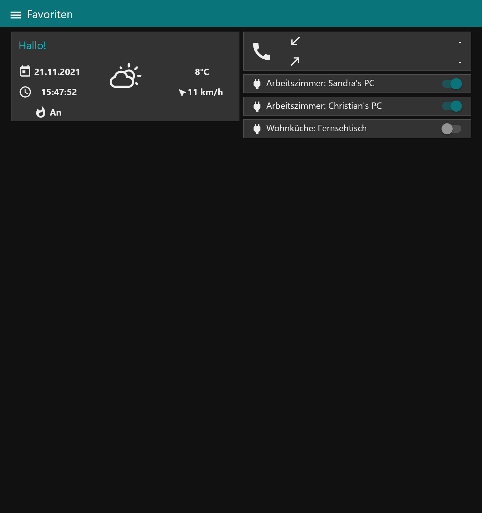
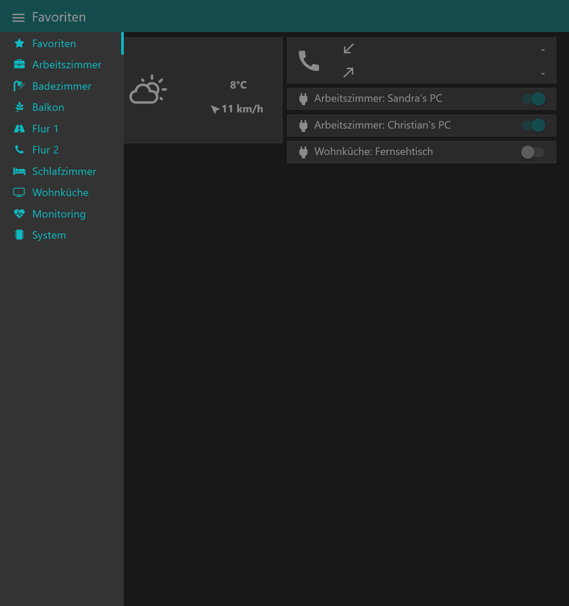
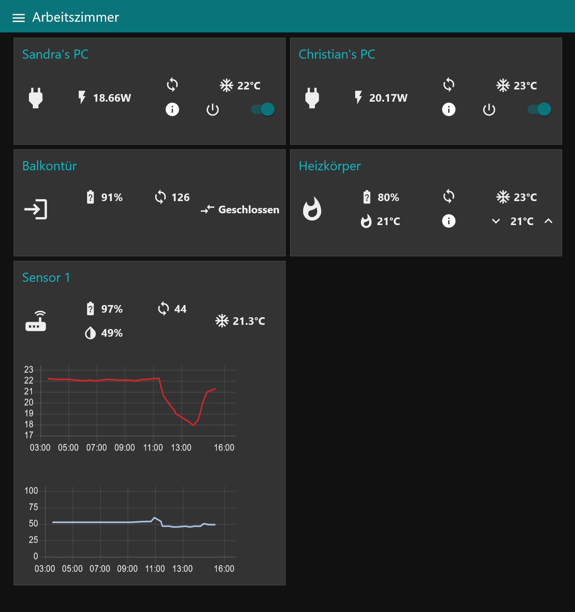
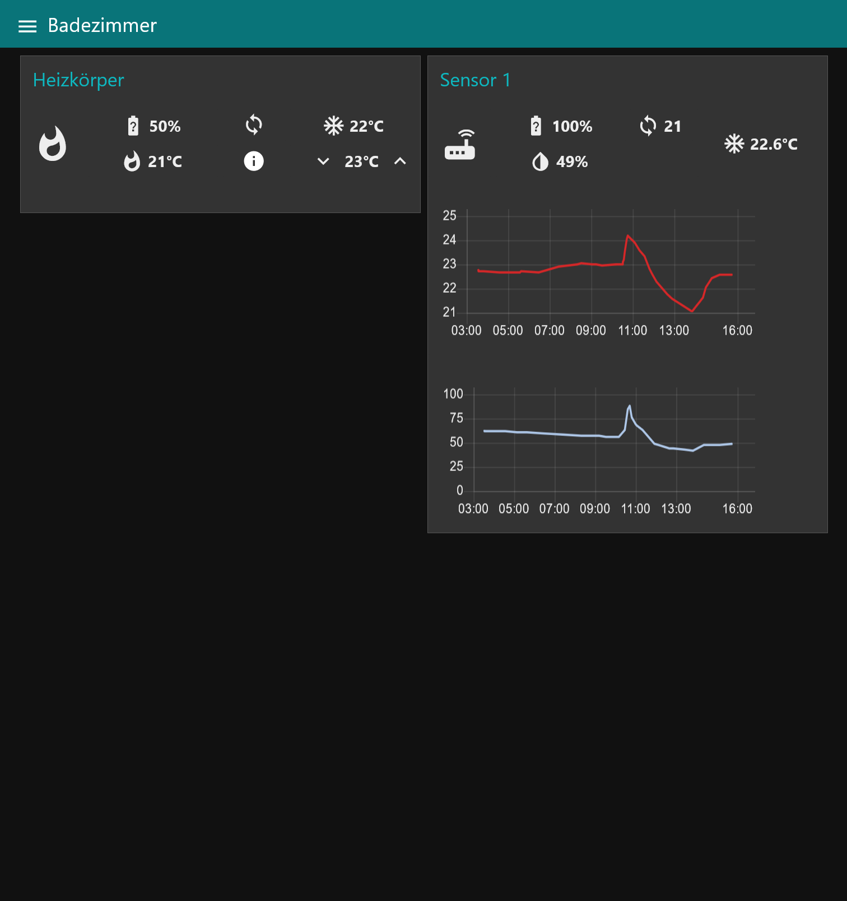
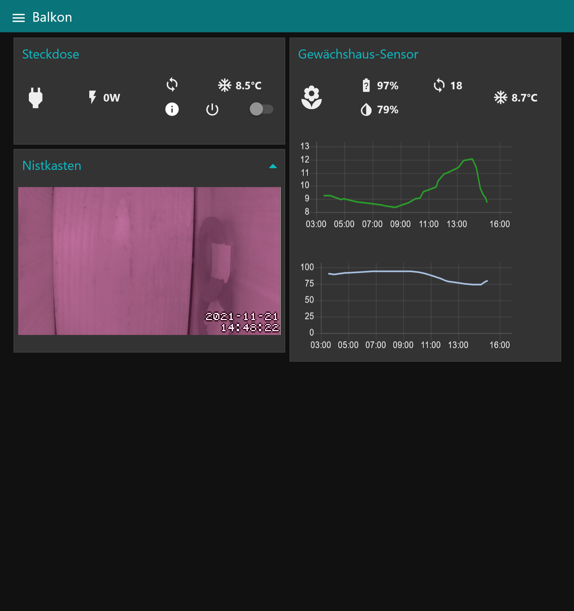
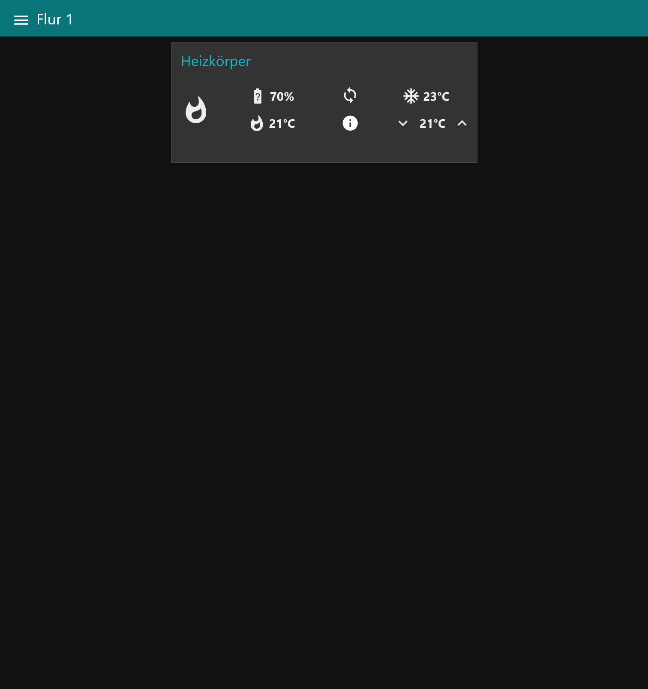
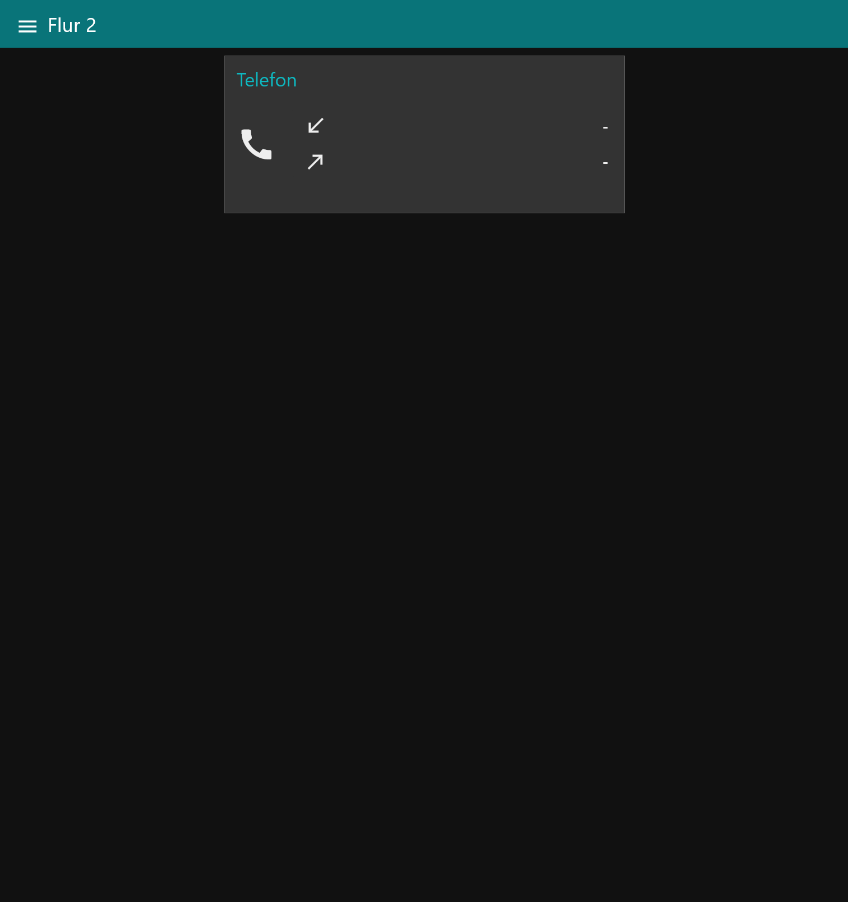
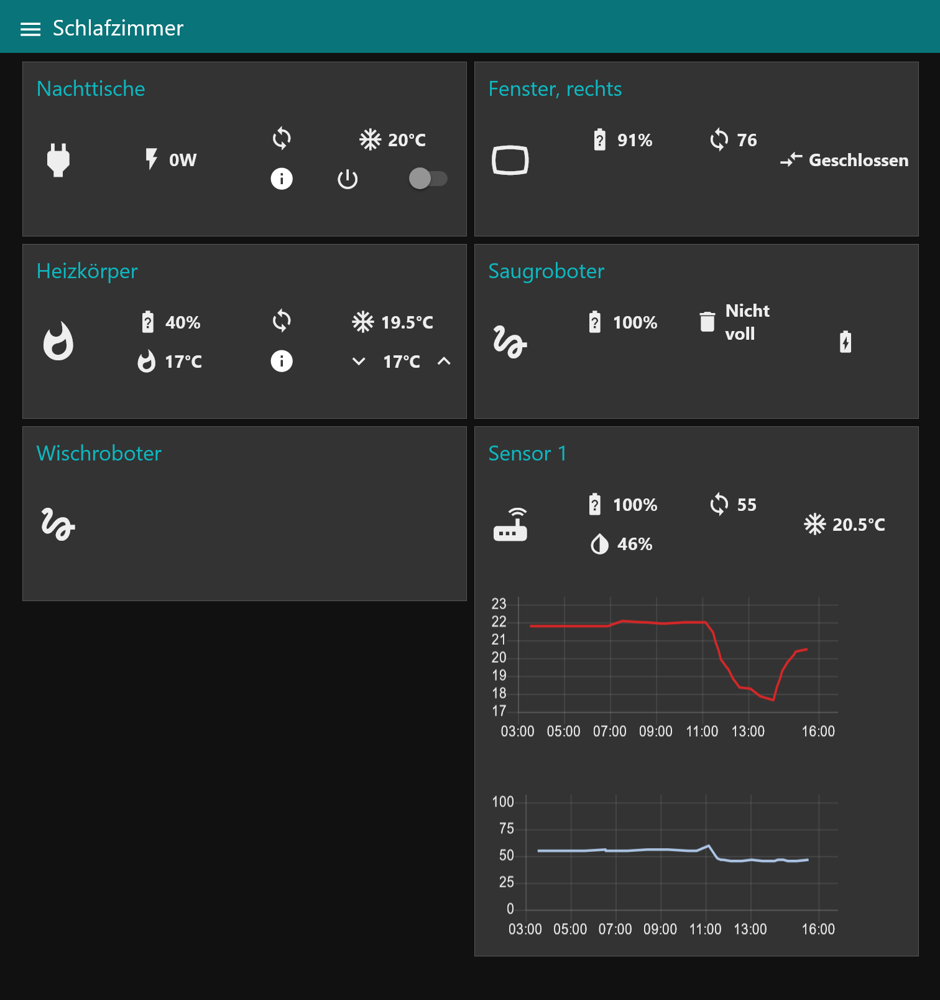
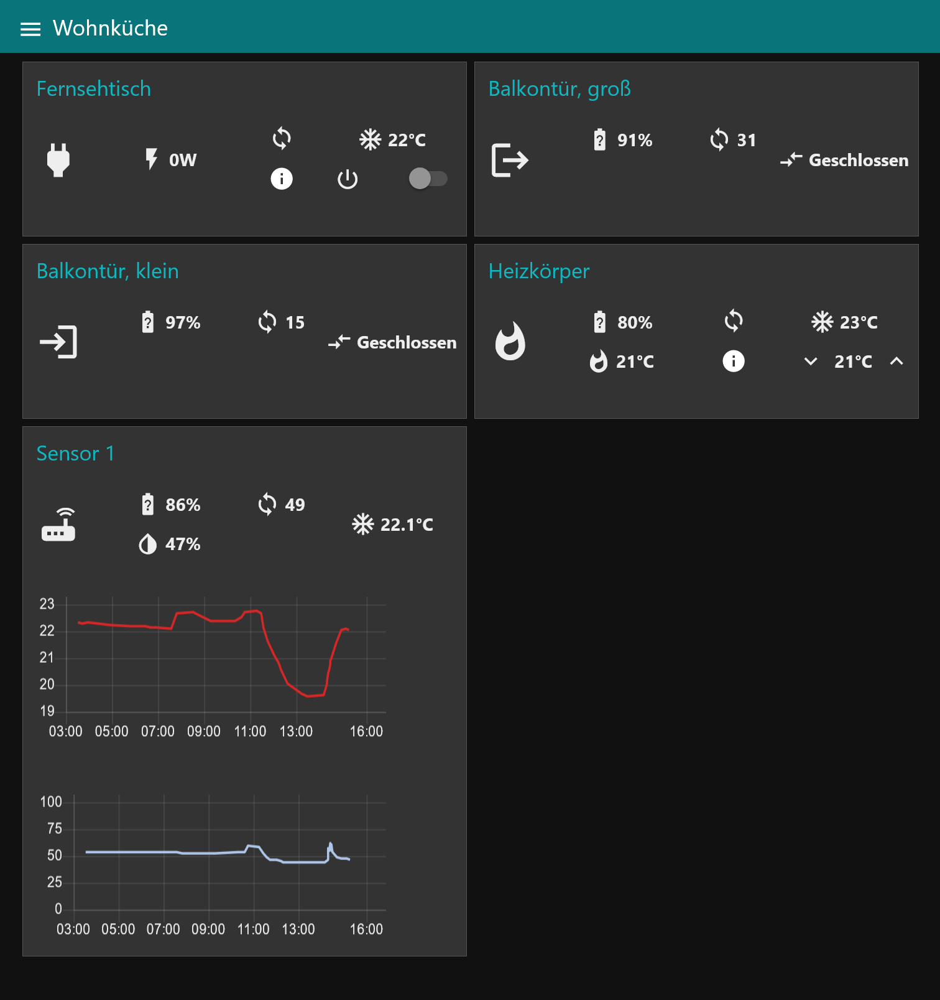
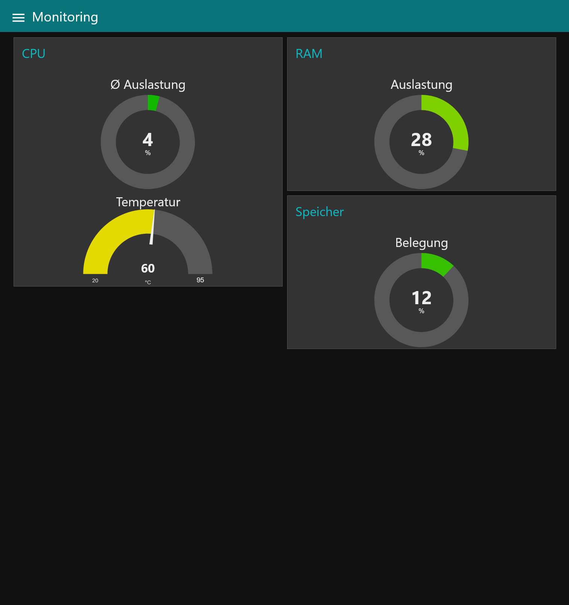
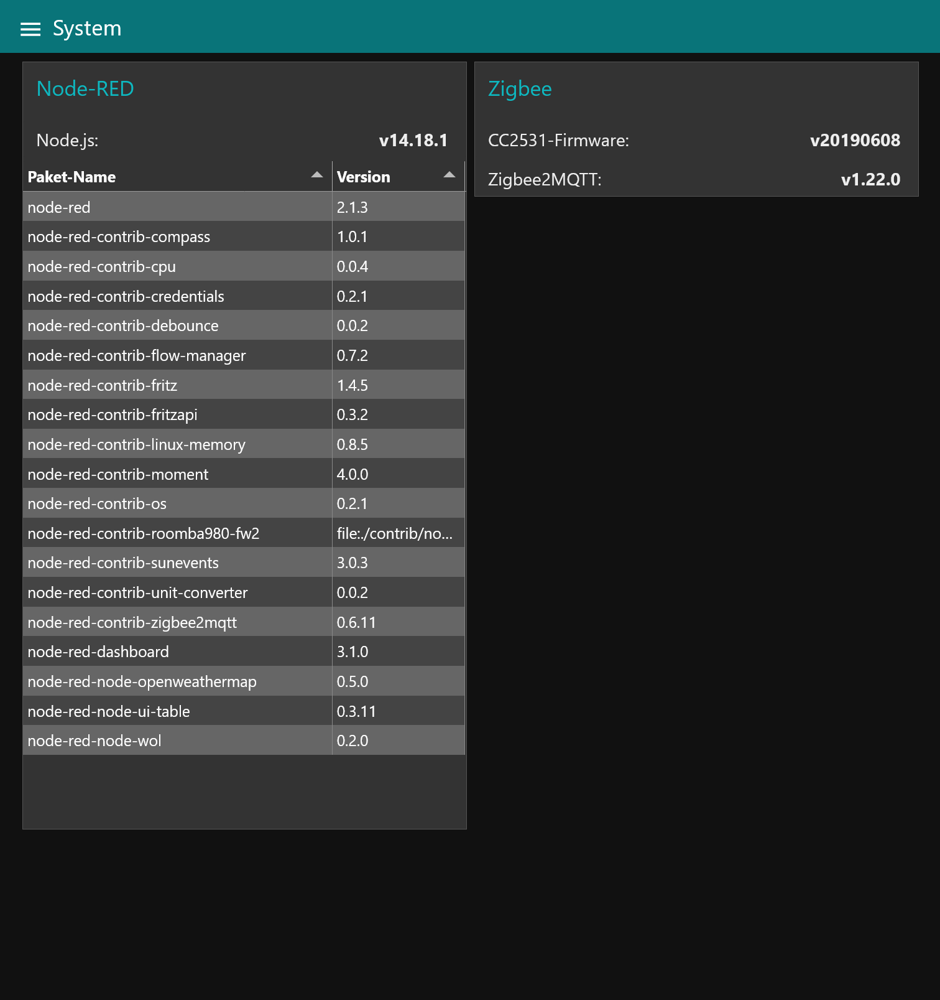


## How to develop, i.e. how to change the flows? 👨‍💻 👩‍💻

Make sure you have installed *Visual Studio Code*.

1. Clone this repository.
2. `cd` inside the cloned folder.
2. In `flow-manager-cfg.json` adapt `filter` to only load desired flows. (Mind: Make sure to include all flows containing credentials.)
2. In `settings.js` set `disableEditor: false` (instead of `true`).
2. Build the Docker image: Run the vscode task `build`.
2. Ensure `./credentials/docker-env.list` exists. See ["a word on docker-env.list"](#-a-word-on-docker-env.list-📝).
2. Start a Docker instance: Run the vscode task `run (dev)`.
2. Open any browser and enter `http://localhost:1880`.
2. Start coding, changes will be reflected in your local machine.


## Appendix


### How to get a pre-built Docker image? ☁️

Get the latest Docker image from Docker Hub:
```sh
docker pull ianstorm/my-smart-home-node-red:latest
```


### A word on `docker-env.list` 📝
The file needs to have the following content:
```
NODE_RED_CREDENTIAL_SECRET=your_secret_goes_here
```
⚠️ Make sure to keep the secret otherwise the flows cannot be decoded/decrypted anymore.
